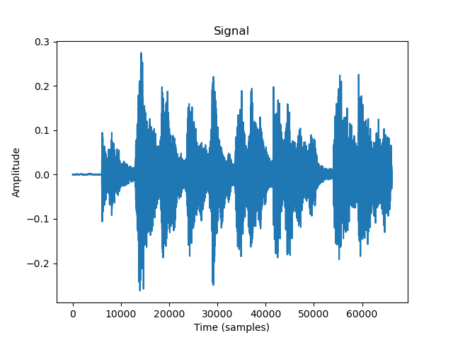
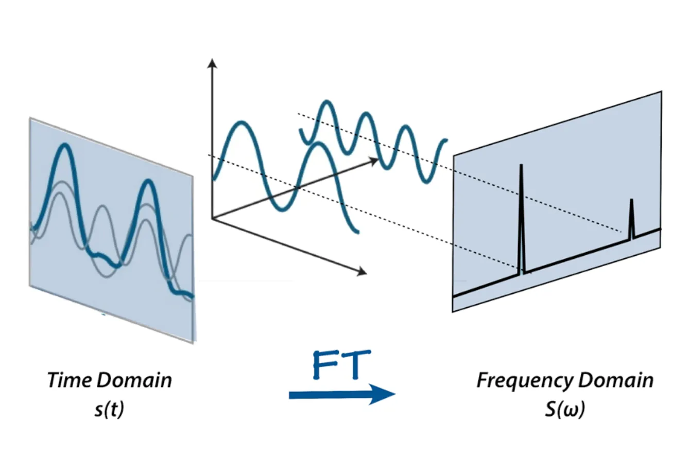
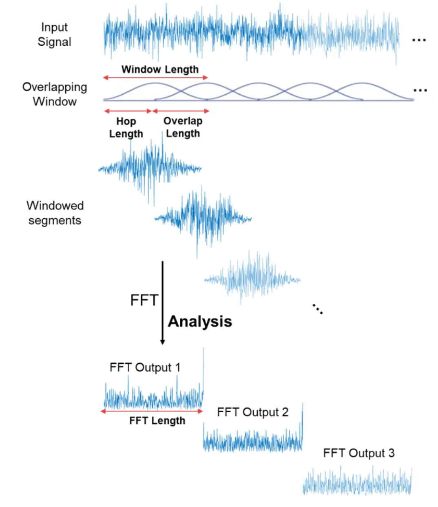
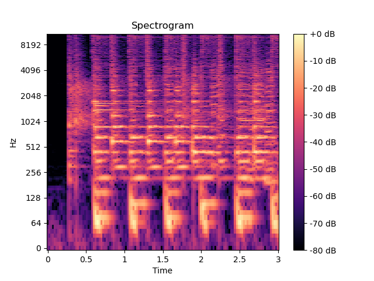
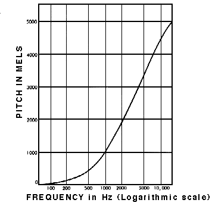
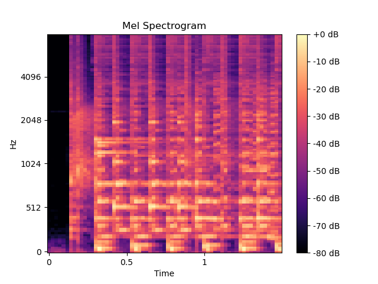

#  理解梅尔谱图(Understanding the Mel Spectrogram)
  
> 文章中的示例音频
[音频文件](CantinaBand3.wav )  
##  信号  
  
信号就是某一特定量随时间变化。对于音频来说，这个特定的变化量就是气压。那我们如何去数字化地捕获这些信息呢？我们可以在某个时间段内对气压进行采样。我们采集数据的采样率是可以变化的，但是最常用的是44.1kHz（每秒采集44100个样）。我们采集到的信号叫做波形（waveform），并且它可以通过计算机软件进行解释，修改和分析。  
```python
import librosa
import librosa.display
import matplotlib.pyplot as plt
  
y, sr = librosa.load('/Users/i2vec/Desktop/xumingjun/speech_algorithm/speech_feature/CantinaBand3.wav')
plt.plot(y)
plt.title('Signal')
plt.xlabel('Time (samples)')
plt.ylabel('Amplitude')
plt.savefig('音频频率图.png')
```

好棒！我们现在拥有了一个可以处理的语音信号数字表示。欢迎来到信号处理的领域！然后，你可能会想，那我们如何从这里提取中有用的信息的？目前看起来是一团乱麻。别担心，我们的朋友**傅立叶变换**正在款款走来！  
##  傅立叶变换  
  
一个音频信号由多个单频声波组成。当我们随着时间对信号进行采样时，我们仅仅能够捕获到最终叠加后的振幅（amplitude）。傅立叶变换是一个数学工具，它能够帮助我们将一个信号分解为多个频率以及频率对应的振幅。换句话说，它可以将信号从时域转化为频域。最终的结果成为谱（spectrum）。  

这是可能的，因为每一个信号都能分解为一些列正弦波和余弦波的叠加。这就是著名的傅立叶定理。  
快速傅立叶变换（fast Fourier transform, FFT）是一种可以高效计算傅立叶变换的算法。被广泛运用于信号处理领域。我们在音频的加窗段上使用这个算法。
```python
import numpy as np
  
n_fft = 2048
ft = np.abs(librosa.stft(y[: n_fft], hop_length = n_fft + 1))
plt.plot(ft)
plt.title('Spectrum')
plt.xlabel('Frequency Bin')
plt.ylabel('Amplitude')
plt.savefig('spectrum.png')
```
##  频谱图  
  
快速傅立叶变换时让我们分析信号内容中频率含量的有力工具，但是如果我们的信号中频率含量含量时随时间变化的呢？例如音乐，讲话。它们又叫做非周期信号。你可能会想：“我们不能通过对多个信号加窗段进行FFT，从而得到多个谱吗？”是的，这就是我们在做的，我们称为**短时傅里叶变换（short-time Fourier transform，STFT）**，FFT信号在信号的重叠加窗段上计算，我们就得到了所谓的频谱图（spectrogram）。

你可以把频谱图当作一堆FFTs彼此叠加的结果。这是一种信号响度，或者频率的视觉表现，因为它随着时间在不同频率上进行变化。除此之外，在计算频谱图的时候还有一些额外的细节。如下图所示，y轴，也就是频率轴以log为尺度（你可以认为是频率取log），并且颜色维度用于表示分贝。这是因为人类只能感知非常小而集中的频率和振幅的范围。
```python
spec = np.abs(librosa.stft(y, hop_length=512))
spec = librosa.amplitude_to_db(spec, ref=np.max)
librosa.display.specshow(spec, sr=sr, x_axis='time', y_axis='log')
plt.colorbar(format='%+2.0f dB')
plt.title('Spectrogram')
plt.savefig('spectrogram.png')
```  

##  梅尔刻度(Mel Scale)  
  
研究表明人们对频率的感知不是线性的，相较于高频率我们对低频率的感知更加好一些。例如我们可以轻松地分辨出500Hz和1000Hz的区别，但是我们很难分辨出10000Hz和10500Hz的区别，尽管这两对频率的差距是相同的。  
在1937年，Stevens，Volkmann，和Newmann提出了一种音高单位，这种单位中相同的差距对听者来说也是相等的。我们称为梅尔刻度。我们对频率进行数学操作使其变为梅尔刻度。
  
##  梅尔频谱（Mel Spectrogram）
  
梅尔频谱是频率转换为梅尔刻度的频谱。他可以通过几行代码实现。
```python
spect = librosa.feature.melspectrogram(y=y, sr=sr, n_fft=2048, hop_length=1024)
mel_spect = librosa.power_to_db(spect, ref=np.max)
librosa.display.specshow(mel_spect, y_axis='mel', fmax=8000, x_axis='time')
plt.title('Mel Spectrogram')
plt.colorbar(format='%+2.f dB')
plt.savefig('mel_spectrogram.png')
```
  
##  总结  
  
1. 我们随着时间对气压进行采样得到数字化的音频信号（signal）表示  
2. 我们通过快速傅立叶变换（fast Fourier Transform, FFT）将音频信号从时域映射到频域。我们对音频信号进行了重叠加窗处理。  
3. 我们将y轴（频率）转化为log刻度，将颜色（振幅）维度转化为音响从而得到频谱图（spectrogram）。  
4. 我们将y轴（频率）转化为梅尔刻度（mel scale）从而得到梅尔谱图。
##  来源  
  
[Understanding the mel spectrogram](https://medium.com/analytics-vidhya/understanding-the-mel-spectrogram-fca2afa2ce53 )
  